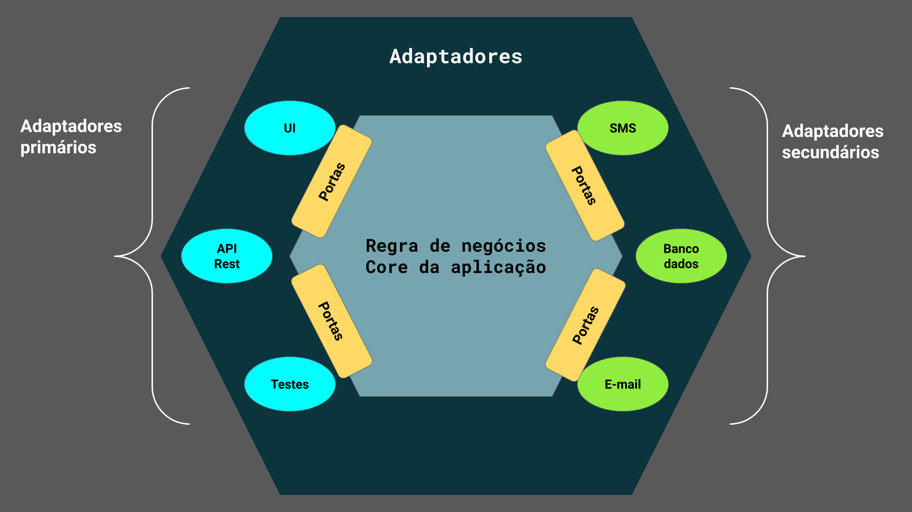

# SistemaVotacaoPauta

## Regras de Negócio

- Cadastrar uma nota pauta;
- Abrir sessão de votação em uma pauta(a sessão de votação deve ficar aberta por um tempo determinado na chamada de abertura ou 1 minuto por default)
- Receber votos de associados em pauta com votos SIM/NÃO. Cada Associado é identificado por um id único e pode votar apenas uma vez por pauta
- Disponibilizar os votos e dar o resultado da votação na pauta

## Documentação de API AWS

A documentação do swagger com os padrões de comunicação está disponível em:

http://ec2-3-144-104-121.us-east-2.compute.amazonaws.com/swagger-ui/index.html

## Tecnologias Utilizadas no Projeto
Para construção do sistema foram utilizadas as tecnologias:
- Java 17;
- Spring Boot Framework 3.0.5;
- Maven 3.8.2
- Aws Cloud;

## Arquitetura Hexagonal utilizada no desenvolvimento do projeto

Neste projeto foi aplicado o conceito de arquitetura hexagonal devido os diversos benefícios que podemos obter
em aplicações grandes com a divisão em camadas, em aplicações muito complexas com o encapsulamento da lógica, em aplicações com muita integração com a utilização de interfaces e serviços, tudo isso garante um aumento considerável na facilidade de manutenção e escalabilidade.
Geralmente aplicações que possuem muitos sistemas consumidores são de difícil manutenção, quando necessário, o impacto externo também acaba sendo grande se os serviços não forem desacoplados da lógica.

## Testes de integração
Foram realizados testes na camada web(controlles), no futuro será implementado a cobertura total do codigo a utilizando o JACOCO.

## Performance 
Na busca pela melhora de desempenho da API desenvolvida foi utilizado o cache em memória para possibilitar o aumento da velocidade de consumo a dados frequentemente acessados, a fim de evitar consultas regulares no banco de dados.
- No futuro, será implementado o teste de performance utilizando a ferramenta de teste de carga de  codigo aberto K6.
## Versionamento da Api

Foi utilizado o versionamento da api por URL, ex : /v1/pauta/criar

O modelo por URL ou por path (URI) é um dos modelos mais utilizados. É muito mais claro e simples para o usuário qual API ele está acessando, permitindo que o usuário consulte a documentação correta.
Muitos frameworks oferecem suporte ao controle de versão definido por rota(URI) ,e quando isso não ocorre, você pode simplesmente estruturar sua API, para que, permita o controle de versão de rota. Por isso, é extremamente fácil de implementar; entretanto, ele adiciona comprimento à sua rota da API REST, o que é a desvantagem.

Os metodo de versionamento por cabeçalhos personalizados seria uma boa opção — eles especificam a versão da API, e o servidor pode responder apropriadamente com os dados de resposta corretos.

Isso pode soar como uma solução fácil; porém, foi considerado que outros desenvolvedores podem extrair os dados por meio da  API de código aberto, sem fornecer cabeçalhos personalizados.

## Consultas Externas(Em desenvolvimento)

Foi implementado um RestTemplate para validar o cpf do associado , contudo a url=https://user-info.herokuapp.com/users/{cpf} nao está mais disponível. 

## Integração Kafka (Em desenvolvimento)
Foi implementado um Kafka Producer Template para simular o envio do resultado para um topico, com a  contagem dos votos da pauta. Esses dados podem ser utilizados por um sistema de notificação por exemplo.